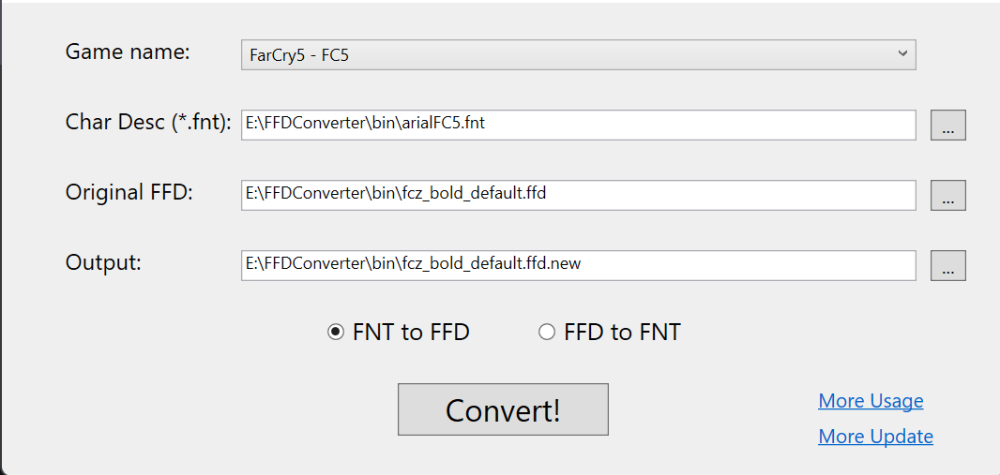
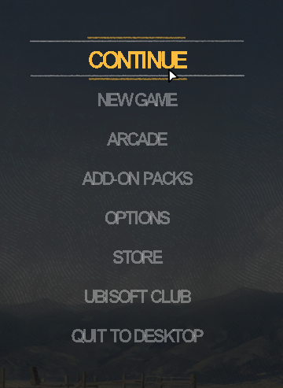
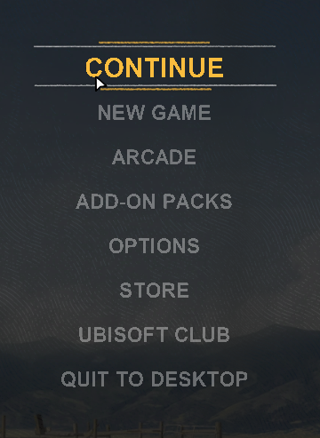
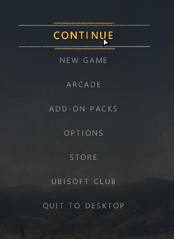
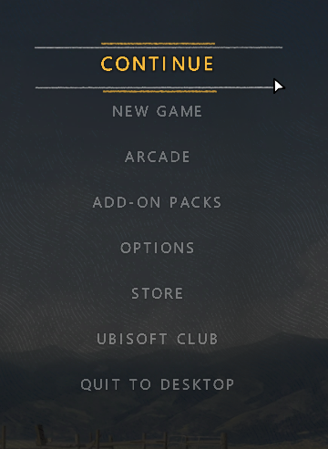
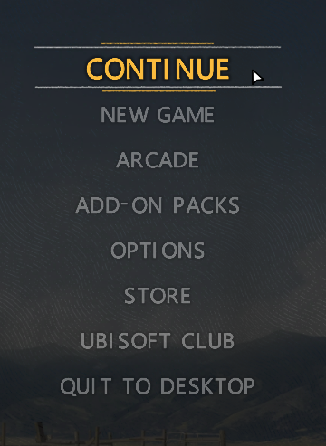

# FFDConverter
FFDConverter is a tool used for creating/editing custom bitmap fonts for AnvilNext, Dunia, Disrupt engine (Far Cry, Assassin's Creed, Watch Dogs games and more... )

## Installation

- Donwload [lastest release](https://github.com/eprilx/FFDConverter/releases).
- Run `FFDConverterGUI.exe` (or run FFDConverter.exe in the cmd)

## Building from source
- **[Install .NET 5](https://dotnet.microsoft.com/download/dotnet/5.0)**
- ``git clone --recurse-submodules https://github.com/eprilx/FFDConverter.git``

## Usage

```
Usage: FFDConverter [OPTIONS]
Options:
      --fnt2ffd              Convert FNT to FFD
      --ffd2fnt              Convert FFD to FNT
  -l, --list                 show list supported games
```
❄ Convert FNT to FFD (Create new FFD)
```
Usage: FFDConverter --fnt2ffd [OPTIONS]
Options:
  -v, --version=VALUE        (required) Name of game. (FC2,FC3,...)
  -f, --originalFFD=VALUE    (required) Original FFD file (*.ffd|*.Fire_Font_Descriptor)
  -b, --charDesc=VALUE       (required) Character description file (*.fnt)
  -o, --NewFFD=VALUE         (optional) Output new FFD file
```
❄ Convert FFD to FNT
```
Usage: FFDConverter --ffd2fnt [OPTIONS]
Options:
  -v, --version=VALUE        (required) Name of game. (FC2,FC3,...)
  -f, --originalFFD=VALUE    (required) Original FFD file (*.ffd|*.Fire_Font_Descriptor)
  -o, --NewFNT=VALUE         (optional) Output FNT file
```
❄ Example:
```
FFDConverter -l
FFDConverter --fnt2ffd -v FC5 -f fcz_bold_default.ffd -b arialFC5.fnt -o fcz_bold_default.new.ffd
FFDConverter --ffd2fnt -v FC5 -f fcz_bold_default.ffd -o - fcz_bold_default.ffd.fnt
```
❄ GUI:



- fcz_bold_default.ffd is the file you get when unpack game files.
- arialFC5.fnt is a character descriptions file generated by [BMFont](https://www.angelcode.com/products/bmfont/) or [Hiero](https://libgdx.com/wiki/tools/hiero)
- fcz_bold_default.ffd.fnt is a character descriptions file exported from original FFD (fcz_bold_default.ffd)

*Note 1: After replace \*.ffd file, you need to replace image file in-game (e.g. \*.xbt from Far Cry series). Take a look about modding image/texture by these tools: AnvilToolkit, FCB Converter, Dunia Tools,...*

*Note 2: Make font more smoother without nasty pixel, try creating [signed distance field font with Hiero](https://libgdx.com/wiki/graphics/2d/fonts/distance-field-fonts#generating-the-font) or searching about ``signed distance field`` for more solution.*

If the font is displayed incorrectly in game, you should edit config.xml to be more compatible.
- *scaleXadvance = 1.0 (left) and scaleXadvance = 1.3 (right)*

&emsp;

- *addCustomYoffset = -3 and -10*

&emsp;

- *scaleWidth = scaleHeight = 8.0 and 12.0*

&emsp;

## Special Thanks
- [abodora](https://github.com/abodora) (providing sample files for Assassin's Creed 2 (AC2), AC Brotherhood, AC Revelation, AC 3 Remastered, AC Rogue, FC New Dawn, FC Primal, Watch Dogs Legion)
- [rezamms](https://github.com/rezamms) (providing sample files for Far Cry 3 Blood Dragon (FC3BD), FC4)
- Eirlys#7340 (providing sample files for Watch Dogs 1, 2)
- [halfway](https://forum.xentax.com/memberlist.php?mode=viewprofile&u=65552) (providing sample files for FC3)
- [ramyzahran](https://forum.xentax.com/memberlist.php?mode=viewprofile&u=63812) (providing sample files for FC Primal)
- [shadow_lonely](https://zenhax.com/memberlist.php?mode=viewprofile&u=221) (providing sample files for I Am Alive)
- [CloudBank-3055](https://github.com/CloudBank-3055) (providing sample files for Anno 2205)
- [Rick Gibbed](https://github.com/gibbed) ([Gibbed.IO](https://github.com/gibbed/Gibbed.IO) library)
## TODO
[Support more game.](https://github.com/eprilx/FFDConverter/issues/2)

## License
[MIT](LICENSE)
